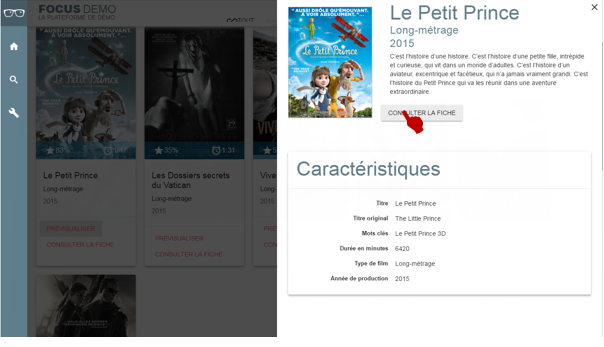
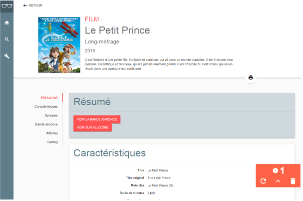

# Comment gérer correctement sa Popin suite à une redirection
Dans le cas de l'application Démo, l'utilisateur a la possibilité de prévisualiser les données d'un film ou d'une personne et ensuite cliquer sur le bouton "consulter la fiche" afin de consulter la page de détail. Généralement suite à une mauvaise utilisation du composant Popin, l'utilisateur se prend une erreur du type "FirstChild of undefined".

L’objectif de ce tutoriel est d’expliquer comment fermer correctement sa Popin suite à une redirection afin de ne plus avoir l’erreur de type « firstChild of undefined ».
# Contexte

* Sur la page d’accueil de l’application, cliquer sur le bouton « PREVISUALISER » 
 


* La Popin de prévisualition s’affiche, ensuite cliquer le bouton « CONSULTER LA FICHE » afin de se rendre sur la page de détail du film.
 
 

* L’utilisateur est redirigé vers la page de détail du film mais il y a une erreur sur la page :
 
 

  Ci-dessous une capture d’écran de la console :

 
 
## Code source 

Dans cette section nous allons vous montrer comment le code était ecrit pour gérer la redirection et la fermeture de la popin.

### Dans la view qui ouvre la popin :

```jsx
     const {movies} = this.props;
        const {movieCodePreview} = this.state;
        return (
            <div data-demo='concept-card-list'>
                {movies &&
                    movies.map(movie => {
                        const {code} = movie;
                        const key = `movie-card-${code}`;
                        return (
                            <MovieCard key={key} movie={movie} onClickPreview={movieId => this.setState({movieCodePreview: movieId})} />
                        );
                    })
                }
                {movieCodePreview &&
                    <Modal open={true} onPopinClose={() => this.setState({movieCodePreview: null})} type='from-right'>
                        <MoviePreview id={movieCodePreview}/>
                    </Modal>
                }
            </div>
        );
```

### Dans le composant de Prévisualisation :

```jsx
const {poster,title} = this.state;
        const {id} = this.props;
        return (
            <div data-demo='preview'>
                <div data-demo='preview-header'>
                    <Poster poster={poster} title={title} hasZoom={true}/>
                    <div>
                        <h3>{this.textFor('title')}</h3>
                        <h5>{this.textFor('movieType')}</h5>
                        <h5>{this.textFor('productionYear')}</h5>
                        <div>{this.textFor('synopsis')}</div>
                        <br/>
                        <Button label='view.movie.action.consult.sheet' handleOnClick={() => {history.navigate(`movies/${id}`, true); window.scrollTo(0, 0);}} />
                    </div>
                </div>
                <div data-demo='preview-content'>
                    <MovieCaracteristics id={id} hasEdit={false}/>
                </div>
            </div>
        ) ;
```

# Cause

L’erreur « FirstChild of undefined » est déclenchée parce que la Popin n’est pas fermée correctement.

# Solution
Dans cette partie nous expliquons comment écrire son code afin de ne plus avoir l’erreur de type « firstChild of undefined » à la fermeture d’une Popin suite à une redirection.

### Dans la view qui ouvre la popin :

* Rajouter une fonction qui sera appelée au moment du clic sur le bouton "Consulter la fiche" et à la fermeture de la popin

```jsx
    _closePopin(cb){
      this.setState({personCodePreview: null}, () => {
            cb && cb();
      });
    }
```

* Ensuite passer cette fonction en paramètre à votre Popin et au composant de Prévisualisation

```jsx
      {personCodePreview &&
         <Modal open={true} onPopinClose={this._closePopin} type='from-right'>
          <PersonPreview id={personCodePreview} onPopinClose={this._closePopin}/>
        </Modal>
      }
```

### Dans le composant de Prévisualisation :

* Rajouter les fonctions suivantes :

```jsx
    onPopinClose() {
        this.props.onPopinClose(this.navigate);
    },

    navigate() {
        history.navigate(`movies/${this.props.id}`, true);
        window.scrollTo(0, 0);
    }
```

* Au clic sur le bouton permettant de rediriger vers une autre page, appeler la fonction onPopinClose

```jsx
  <Button label='view.movie.action.consult.sheet' handleOnClick={this.onPopinClose} />
```


