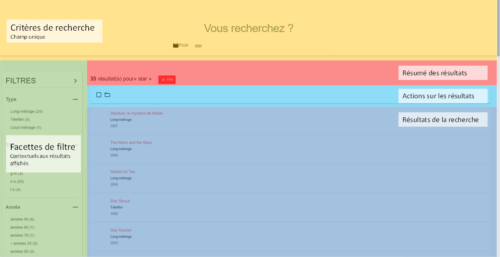

# La recherche avancée FOCUS ? comment l'implémenter ?

La recherche est un concept au centre des applications métiers, et donc au centre des concepts FOCUS.

Dans ce tutoriel, nous allons détailler pas à pas l'ensemble des étapes et des componsants FOCUS à utiliser, permettant d'accélérer les développements d'une page de recherche.

## Anatomie d'une page de recherche

La recherche FOCUS reprend les grands principes de recherches issus du e-Commerce :
* Un champ unique de recherche "à la Google"
* Une liste de résultats (triable, groupable) sur laquelle il est possible d'agir en masse
* Des filtres prédéfénis sur forme de facettes

## Avant de commencer

Un exemple concret d'implémentation de la recherche avancée a été rédigée par nos petites mimines : https://github.com/KleeGroup/focus-demo-app

Si vous êtes sur le réseau interne, une démo online de la recherche avancée est disponible ici : http://focus-demo.dev.klee.lan.net/

## Que gère le composant FOCUS de recherche avancée ?

Le composant de recherche avancée gère automatiquement:
* La présentation graphique de tous les composants de la recherche avancée, selon la mise en page affichée au dessus
* L'affichage automatique
    * des facettes et valeurs (à gauche), fourni en réponse de l'appel du WS de recherche
    * de la liste de résultats au centre de l'écran
    * du nombre de résultats total pour la requête dans résumé (en haut de la liste)
* Les appels au service de recherche lors
    * de la modification d'un critère de recherche (scope ou input de recherche)
    * d'un clic sur une valeur de facette (à gauche)
    * d'un critère de filtre (dans la barre d'action)
    * d'un critère de grouping (dans la barre d'action)
* Le store des données de recherche

## 0. Création du repértoire de la vue

Commencons par créer un dossier regrouper l'ensemble des vues relatives à la recherche dans le projet, dans le répertoire `views`.

La manière dont vous organisez votre dossier vous incombe. Cependant, nous vous conseillons très fortement cette organisation:
* Regrouper tous vos écrans de recherche dans le répertoire `views/search`, qui du coup contiendra :
    * `views/search/advanced` qui contiendra les développements spécifiques à la recherche avancée
    * `views/search/lines` qui contiendra l'implémentation du rendu des lignes pour la recherche (avancée et rapide)
    * `views/search/quick` qui contiendra les développements spécifiques à la [recherche rapide](recherche-rapide.md)

## 1. Création du service de recherche

## 2. Création de la vue

## 3. Création de la configuration

## 5. Création du Line Mapper

## 6. Définition du comportement au click sur une ligne
